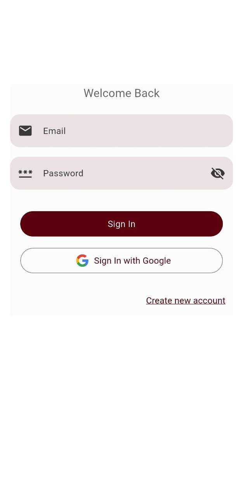
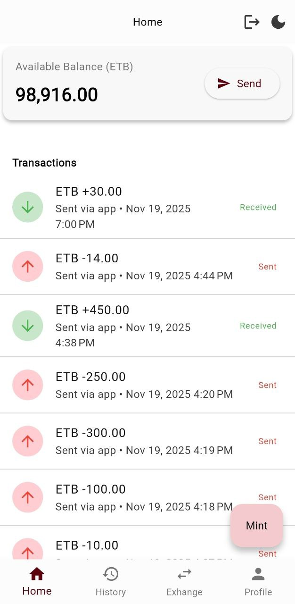
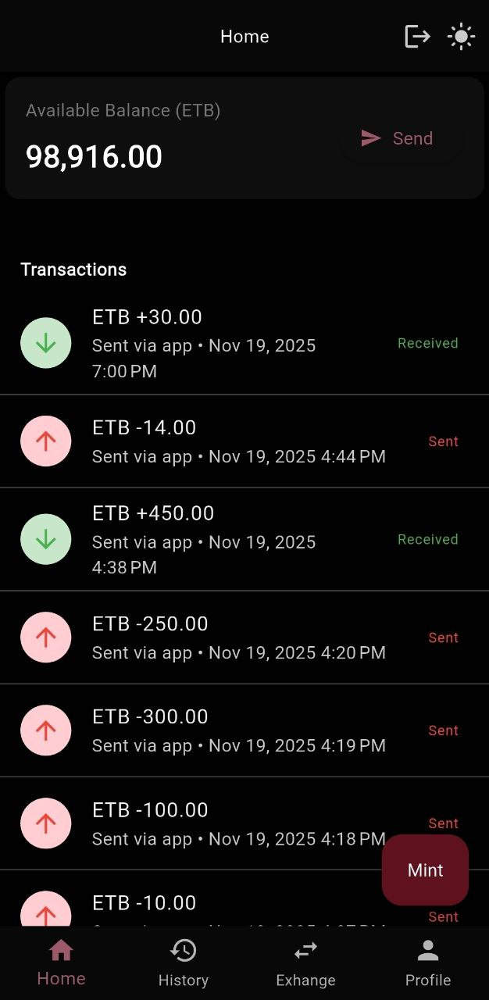

# Remit - Flutter Application

## Overview

A very light financial management app built with Flutter, featuring **Clean Architecture**, **Riverpod** for state management, and **Firebase** for backend services. It supports authentication, wallet transactions, and dynamic theming.

---

## Project Structure (Clean Architecture)

### **Domain Layer**

- **Entities** (Immutable models):
  - `TransactionRecord` (Freezed)
  - `UserAccount` (Freezed)
  - `ExchangeRate`
  - `ResponseData`
- **Repository Interfaces**:
  - `IAuthRepository`
  - `IWalletRepository`
  - `IExchangeRatesRepository`

### **Data Layer**

- **Repositories** (Firebase implementations):
  - `AuthRepository`
  - `FirebaseWalletRepository`
  - `ExchangeRateRepository`
- **Data Sources**:
  - Remote (Firestore)
  - Local (SharedPreferences)

### **Presentation Layer**

- **Screens**:
  - Auth: `LoginView`, `SignupView`
  - Home: `HomeView`, `HomeTabView`
  - Startup: `StartupView`
  - Transactions: `TransactionView`
  - Profile: `ProfileView`
- **Providers** (Riverpod):
  - `AuthProvider`
  - `WalletProvider`
  - `ThemeProvider`
  - `ExchangeProvider`
- **UI Utilities**:
  - Widgets (`ActionButton`, `AppBarWidget`, etc.)
  - Helpers (`DateTimeUtils`, `ValidatorsUtils`, etc.)

---

## Key Features

- **Authentication**: Login/Signup with Firebase Auth.
- **Wallet Management**: Track transactions using Firestore.
- **Dynamic Theming**: Customizable UI with `FlexColorScheme`.
- **Routing**: Navigation via `GoRouter`.
- **Validation**: Utilities for form validation.

---

## Dependencies

| Category         | Packages                                            |
| ---------------- | --------------------------------------------------- |
| State Management | `flutter_riverpod`                                  |
| Navigation       | `go_router`                                         |
| Firebase         | `firebase_core`, `firebase_auth`, `cloud_firestore` |
| Styling          | `google_fonts`, `flex_color_scheme`                 |
| Local Storage    | `shared_preferences`                                |
| Serialization    | `freezed_annotation`, `json_annotation`             |
| Utilities        | `nb_utils`, `intl`                                  |

---

## Getting Started

### Prerequisites

- Flutter SDK (>=3.9.2)
- Firebase project with `google-services.json` and `GoogleService-Info.plist`.

### Installation

1. Clone the repo:
   ```bash
   git clone https://github.com/emantggw/remit.git
   ```
2. Install dependencies:
   ```bash
   flutter pub get
   ```
3. Generate Freezed files:
   ```bash
   dart run build_runner build --delete-conflicting-outputs
   ```
4. Run the app:
   ```bash
   flutter run
   ```

---

## Development Workflow

- **Run Tests**:
  ```bash
  flutter test
  ```
- **Codegen** (Freezed):
  ```bash
  dart run build_runner watch
  ```

---

## Screenshots

|  |  |  |
| ------------------------------- | ----------------------------------- | --------------------------------------- |

---

## Contributing

1. Fork the repository.
2. Create a branch (`git checkout -b feature/xyz`).
3. Commit changes (`git commit -m 'feat: Add feature xyz'`).
4. Push to the branch (`git push origin feature/xyz`).
5. Open a Pull Request.

---

## License

MIT License. See `LICENSE` for details.

---

### Notes:

1. **Firebase Setup**: Ensure `google-services.json` and `GoogleService-Info.plist` are placed in `android/app/` and `ios/Runner/`.
2. **Freezed**: Re-run codegen after modifying entities.
3. **Routing**: Guarded routes can be added via `GoRouter` middleware.

### Author:

Amanuel.T (aka: emantggw)
